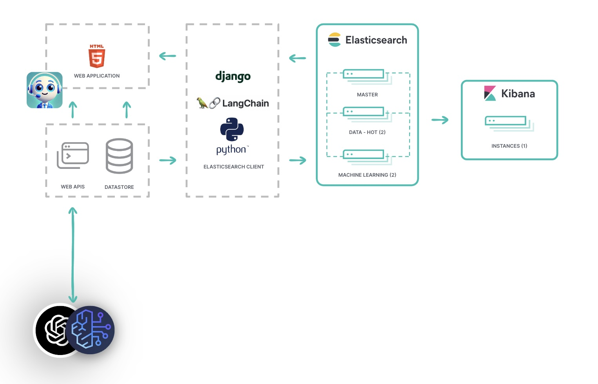

# Online banking prototype demo
The idea behind this repo is to provide an easy way to demonstrate how Elastic can improve both customer facing and
internal bank visibility and analytics through the implementation of data de-normalization, semantic search and generative AI.

#### This project has been designed to connect to an Elastic Cloud cluster, and an Azure OpenAI endpoint. You have the option of running it locally for development or as a container to save time.



Begin by downloading this repo to your local machine or host.

Irrespective of how you deploy the python app, you will need an Elasticsearch cluster setup and running.

### Elasticsearch config:

Your cluster will need:

- 8GB RAM hot nodes
- 4GB RAM ml nodes
- 1GB RAM kibana node
- 2GB RAM search node
- an Integration node if you want to instrument the application later

Once you have a cluster configured, you can deploy '.elser_model_2_linux-x86_64' trained model in your cluster directly from the interface. If you choose another model you must consider the implications of updating the query code as the format of the semantic search is done using text expansion.

In order for sentiment analysis to work on the LLM logging capability, you will need a sentiment model. You can use the interface to deploy 'nlptown__bert-base-multilingual-uncased-sentiment' as this provides a score based on stars (5 being the most positive and 1 being the least) and also gives a confidence prediction out of 1.

You will need to to install eland[pytorch] using pip:

````bash
python -m pip install 'eland[pytorch]'
````

## Run as-is using Docker:

- Navigate to the root folder of the downloaded repo.
- using the file env.example as a template, construct your .env file with all of the necessary credentials required to run the demo.
- Option 1 : Use the prebuild docker container:

Docker version will come in two flavors :

- elasticbank: version that will cover most of the elasticbank demo aside the sentiment analysis
- elasticbank-complete: heavier version that contains all the _elastic-enabled-bank_ docker features with eland for sentiment analysis NLP model import

_elasticbank_

````bash
sudo docker run --env-file .env -d --rm --name elastic-bank -p 8000:8000 ghcr.io/timbrophy/elasticbank
````

_elasticbank-complete_

````bash
sudo docker run --env-file .env -d --rm --name elastic-bank-complete -p 8000:8000 ghcr.io/timbrophy/elasticbank-complete
````

- Option 2 : Build the container image:

````bash
sudo docker build -t <your_chosen_image_name> .
````

Next, run the container to bind on port 8000:

_elasticbank_

````bash
sudo docker run --env-file .env -d --rm --name elasticbank -p 8000:8000 <your_chosen_image_name>
````

_elasticbank-complete_

````bash
sudo docker run --env-file .env -d --rm --name elasticbank -p 8000:8000 <your_chosen_image_name>
````

Your host should now serve the demo on port 8000.

You can skip the next section and go straight to "Configuring the Elastic Enabled Bank" section below.

## Set up locally on your environment:
### Ideally you need to have experience with Python.

### Prerequisites
You must have Python 3.10 or above installed locally on the system you intend to run this demo on.
In addition, please review the contents of the env.example file in this repo and ensure you have the necessary details to populate the template.
Certain credentials will be generated as you build the application.

Specifically:

- DJANGO_SECRET_KEY - this gets created when you build your django project
All other details in the .env file will need to be obtained prior to the setup of this project.

### Installation
To begin:
- navigate to the project root in terminal
- create a new virtual environment.

The command to do this is:
````
python3 -m venv <your_preferred_env_name>
````

Next, activate the virtual environment with the following command:
````
source <your_newly_env_folder>/bin/activate
````
Once you've done this successfully you will see that your terminal input is prefixed by
  (your_env_name). This denotes that your virtual environment is active. If you want to
deactivate it, you simply type: deactivate.

You can learn more here:
````
https://docs.python.org/3/library/venv.html
````

Now that your environment is active, you need to install all the project dependencies:
````
pip install -r requirements.txt
````

### Project configuration:

Create a fresh .env file, and use the contents of env.example as a template. You will need all of these values in order for the
application to work. Adjust all the variables to your setup.

Source the file in your terminal before starting the following commands.

```bash
source .env
```

IMPORTANT: Generate a DJANGO_SECRET_KEY and put it to the .env file as well:

```bash
python -c 'from django.core.management.utils import get_random_secret_key; print(get_random_secret_key())'
```

Make sure all migrations are applied

````bash
python manage.py migrate
````

In your terminal, enter the following command to start the webserver:

````bash
python manage.py runserver
````

Access the front-end of the online banking app by entering "127.0.0.1:8000" in your browser.

And hey, look at that, we're running an ***Elastic-enabled bank!***

### Configuring the Elastic Enabled Bank:

- Start with the Environment Setup, confirm you can connect with your cluster and execute the index and pipeline builds. The homepage of the setup view contains a checklist to confirm the status of your configuration.
- In order for the ***Customer support demo*** to work, you MUST manually set up a knowledge base as there is no Web Crawler API.
- This means that if you want to remove any named entity references you need to build your own pipeline to do it. 
- Once you have ingested data into your customer support knowledge base and correctly referenced it in the .env file, you can perform a reprocessing action from the Environment Setup > Knowledge Base section in order for the contents of your index to be chunked and run through an inference pipeline. This makes your customer support demo ***infinitely*** more effective as the LLM gets really precise context to work from.
- Next you need to generate new transaction data, and then export that data to the Elastic cluster. The tooling to do so is quite straightforward to understand. NB: When you export to Elastic, just leave the process to run, do not navigate off the page as it cannot run asynchronously. If you're exporting a really huge dataset and the browser times out, then you can go back and
use the Export function again - you will not duplicate any records in Elastic as any exported records are flagged and not re-imported.
- The overall demo homepage has storylines with click throughs, but you can just hit the Online banking portal and run your own storyline if you want to.